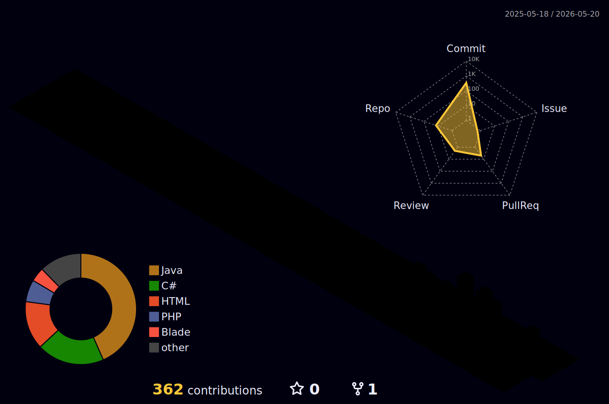

# 
✨ Welcome to my Code Space! ✨

  

  

---

### 💫 About Me

<table align="center">
  <tr>
    <td width="55%" style="border: none; vertical-align: top;">
      
🚀 <b>Current Status:</b> 3rd Year @ <b>FPT University</b>

      
🎨 <b>Focus:</b> Fullstack Development | UI/UX & Animations

      
💡 <b>Philosophy:</b> <i>"Clean code is not just a standard, it's an art."</i>

      
🛠️ <b>Active Projects:</b> 
        <ul>
          <li><b>Smart Garage:</b> IoT system using ESP32.</li>
          <li><b>Genealogy App:</b> Family tree management system.</li>
        </ul>
      

</td>
   <td width="45%" style="border: none; vertical-align: middle; text-align: center;">
  
<b>🏆 Achievement Unlocked</b>

  
</td>
  </tr>
</table>

---

### 📊 Performance Metrics

  
  

### 🐍 My Coding Journey

  <picture>
    <source media="(prefers-color-scheme: dark)" srcset="https://raw.githubusercontent.com/minhcamon/minhcamon/output/github-contribution-grid-snake.svg">
    
  </picture>

  

### 🏙️ My GitHub City

  

---

### 🤝 Let's Connect!

  
  
  
  

 

  

